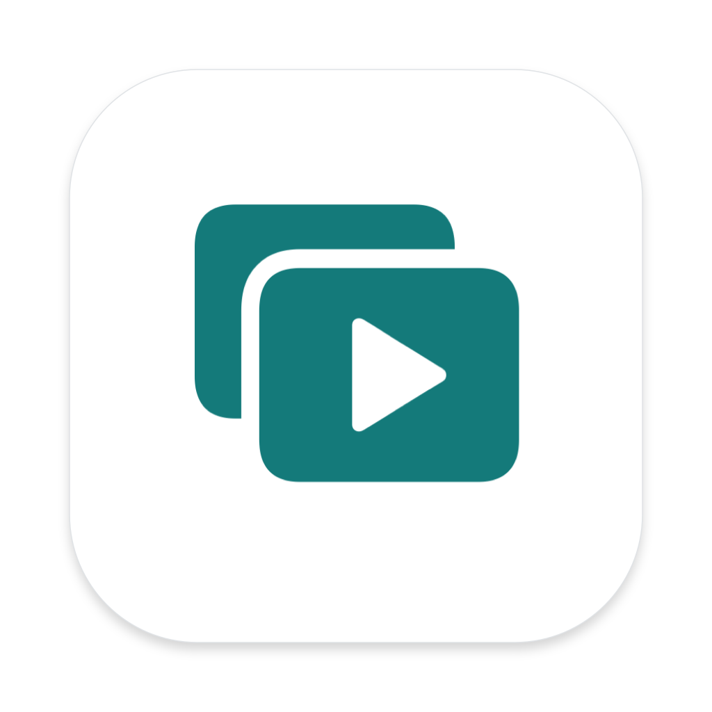

# LectureMerge

**Объединение готового видео, русской озвучки и субтитров в одну лекцию.**
Локальное приложение для macOS 14+ и Apple Silicon, с русским интерфейсом.

Текущий выпуск: **2.0.2**. Эта папка — основной проект для дальнейшей разработки.



## Запуск

Откройте [Сборка лекций 2.app](<dist/v2.0.2/Сборка лекций 2.app>)
либо **Открыть LectureMerge.command**. Название приложения в macOS пока
«Сборка лекций 2»; английское название проекта — LectureMerge.
FFmpeg, FFprobe и LAME уже внутри `.app`, соседние исходники для запуска не нужны.

Архив готовой версии, исходники и контрольные суммы:
[releases/v2.0.2](releases/v2.0.2). Следующие выпуски получают свои папки.
На GitHub эти локальные ZIP-файлы добавляются как вложения Releases;
в истории Git хранятся только исходники и документация.

## Возможности

- Новый увеличенный значок: две бирюзовые карточки, прозрачный фон.
- MP4: H.264, русский звук первым и основным, немецкий оригинал отдельно,
  русские и немецкие переключаемые субтитры.
- Готовый RU AAC-LC из `.ru.siri.voice.m4a` копируется без перекодирования.
  Совместим с форматом **SRT Озвучки 1.1**; WAV также поддерживается.
- Короткая озвучка, совпадающая с концом RU SRT, разрешена: видео сохраняется
  полностью, а после последней реплики остаётся участок без русской речи.
- Разрешения от 144p до 4K, исходный размер или копирование видео без потерь.
- Только звук: AAC без перекодирования, AAC 96–256 или MP3 128–320 кбит/с.
- Очередь до четырёх параллельных заданий, аппаратный H.264 VideoToolbox.
- Открытие исходника, Delete/Backspace, контекстное меню, очистка списка.
- Сохранение и открытие проектов `.olyalecture`.
- Проверка результата перед публикацией; исходные файлы сохраняются.

Интернет и API для работы программы не нужны. [Как пользоваться](docs/USAGE.md).

## Структура проекта

```text
lecture_merge/
├── Sources/          Swift: интерфейс, очередь, видео, звук, проекты
├── Tests/            Интеграционные проверки и измерения
├── Scripts/          Сборка, тесты, создание и проверка релизов
├── Assets/           Значок приложения
├── vendor/           Лицензии и список зависимостей с SHA-256
├── docs/             Пользование, сборка, архитектура, версии, проверки
├── .github/          CI, шаблоны ошибок и pull request
├── dist/v2.0.2/      Готовое приложение; исключено из Git
├── releases/v2.0.2/  Архивы выпуска; исключены из Git
├── VERSION          Версия приложения
├── BUILD_NUMBER     Номер сборки macOS
├── CHANGELOG.md     История изменений
└── AGENTS.md         Правила дальнейшей работы с проектом
```

## Разработка и выпуск

```bash
bash Scripts/check.sh             # Структура проекта и проверка Swift
bash Scripts/test.sh              # Видео, AAC, MP3, проекты, параллельность
bash Scripts/build.sh --preview   # Новая отдельная пробная сборка
```

Для следующего выпуска создаётся ветка, обновляются `VERSION`, `BUILD_NUMBER`
и `CHANGELOG.md`. После проверок `build.sh` собирает новый `dist/vX.Y.Z`,
а `release.py` создаёт новый Git-тег и `releases/vX.Y.Z`.
Существующий номер выпуска скрипты перезаписывать отказываются.
Полный порядок: [VERSIONING.md](docs/VERSIONING.md).

## Документация

- [Использование](docs/USAGE.md) и [переход на основную папку](docs/MIGRATION.md)
- [Сборка и тесты](docs/BUILD.md)
- [Архитектура](docs/ARCHITECTURE.md)
- [Правила версий и откат](docs/VERSIONING.md)
- [Проверка выпуска 2.0.2](docs/VERIFICATION-2.0.2.md) и [проверки прежних выпусков](docs/VERIFICATION.md)
- [GitHub и CI](docs/GITHUB.md)
- [Сторонние компоненты](THIRD_PARTY.md) и [вклад в разработку](CONTRIBUTING.md)

Репозиторий пока локальный; GitHub remote не подключён. Лицензия на собственный
код проекта владельцем пока не выбрана. Лицензии внешних компонентов сохранены
отдельно и включены в приложение.
