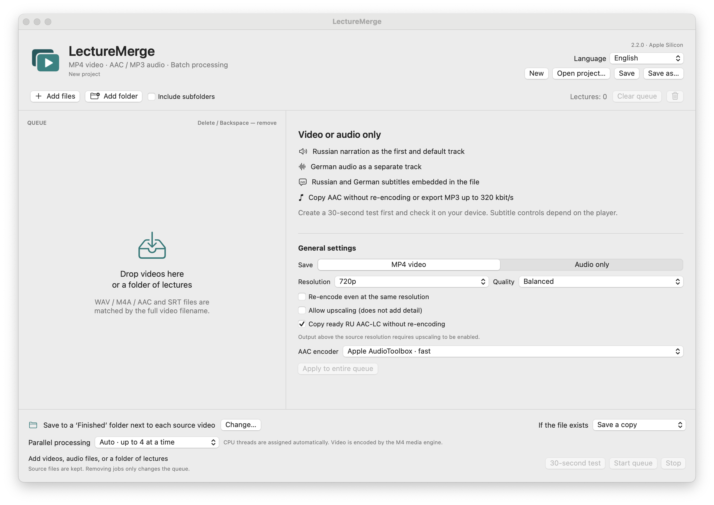

# LectureMerge

[User guide](https://popovantondev.github.io/LectureMerge/Guide-en.html)

[Download for macOS](https://github.com/popovantondev/LectureMerge/releases/tag/v2.2.0) · [English guide](docs/en/README.md) · [Deutsches Handbuch](docs/de/README.md) · [Русское руководство](docs/ru/README.md)


**macOS 14 or later · Apple Silicon · Version 2.2.0**

LectureMerge combines lecture video, Russian narration, original audio, and subtitles in one MP4 file. It can also export audio as AAC or MP3. The app works locally on your Mac and does not require an internet connection or an online API.



## Features

- Switch the interface between Russian, German, and English. The choice is saved for later launches.
- Create MP4 files with H.264 video, AAC audio, and switchable Russian and German subtitles.
- Copy compatible AAC-LC narration without re-encoding.
- Keep the original German audio as a separate track.
- Resize from 144p to 4K, preserve the original dimensions, or copy compatible H.264 without re-encoding.
- Export AAC or MP3 audio, including AAC copy mode and MP3 up to 320 kbit/s.
- Process up to four queue items at once, save projects, and run a 30-second test before a full export.

## Download

Version 2.2.0 is available from the [GitHub Releases page](https://github.com/popovantondev/LectureMerge/releases/tag/v2.2.0). Release packages include the app, source archive, manifest, checksums, and third-party notices.

The app supports Apple Silicon Macs running macOS 14 or later. It is ad-hoc signed and is not notarized by Apple. Start with the guide for your interface language: [English](docs/en/README.md) · [Deutsch](docs/de/README.md) · [Русский](docs/ru/README.md).

## Documentation

- User guides with a screenshot in the matching interface language: [English](docs/en/README.md), [Deutsch](docs/de/README.md), [Русский](docs/ru/README.md)
- Build and test: [EN](docs/en/BUILD.md) · [DE](docs/de/BUILD.md) · [RU](docs/ru/BUILD.md)
- Architecture: [EN](docs/en/ARCHITECTURE.md) · [DE](docs/de/ARCHITECTURE.md) · [RU](docs/ru/ARCHITECTURE.md)
- Rights: [EN](docs/en/RIGHTS.md) · [DE](docs/de/RIGHTS.md) · [RU](docs/ru/RIGHTS.md)
- Third-party notices: [EN](docs/en/THIRD_PARTY_NOTICES.md) · [DE](docs/de/THIRD_PARTY_NOTICES.md) · [RU](docs/ru/THIRD_PARTY_NOTICES.md)
- Changelog: [EN](docs/en/CHANGELOG.md) · [DE](docs/de/CHANGELOG.md) · [RU](docs/ru/CHANGELOG.md)

## Build from source

On an Apple Silicon Mac with Apple Command Line Tools installed:

```bash
bash Scripts/check.sh
bash Scripts/test.sh
bash Scripts/build.sh --preview
```

See the guide in your language for build requirements and verification details. CI checks project metadata and Swift types on macOS; hardware media encoding is verified locally.

## Rights and third-party software

The original source code is published for public viewing only; no open-source license is granted. Individuals may download and run an unmodified release binary for personal use. Read the notices in [English](docs/en/RIGHTS.md) · [Deutsch](docs/de/RIGHTS.md) · [Русский](docs/ru/RIGHTS.md), and the [third-party notices](docs/en/THIRD_PARTY_NOTICES.md). The licenses for bundled components continue to apply to those components.

## Feedback

Bug reports and suggestions are welcome in English, German, or Russian through [GitHub Issues](https://github.com/popovantondev/LectureMerge/issues/new/choose). Include the app and macOS versions; remove personal paths, lecture files, and subtitle text from reports.
