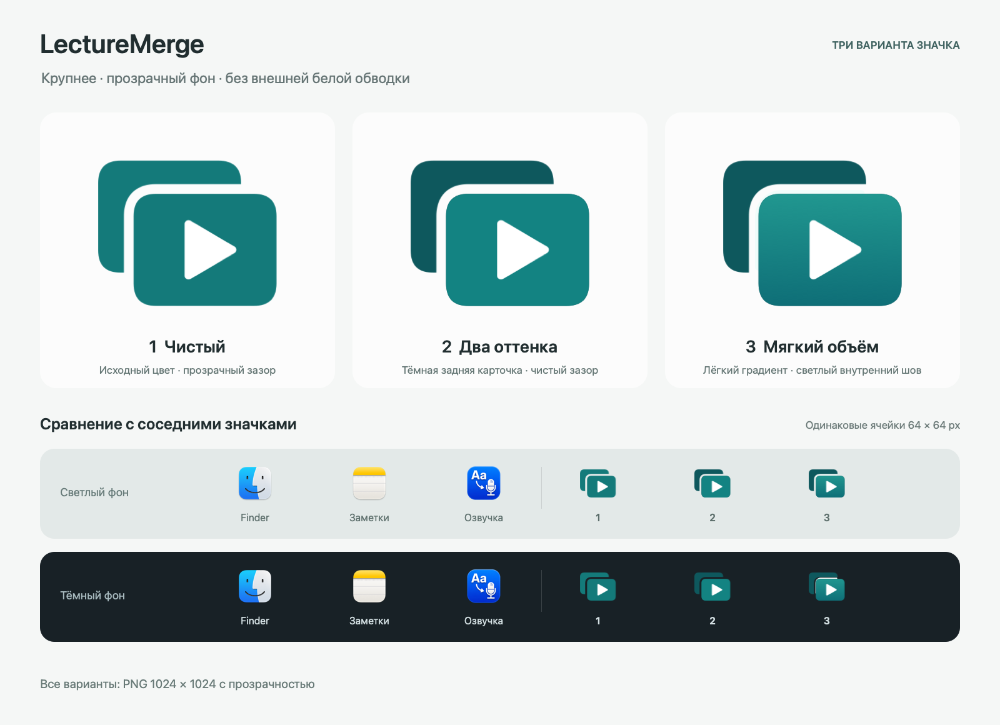

# Варианты значка LectureMerge

Дата: 2026-09-03. Статус: **предложения для выбора владельцем**.



| № | Вариант | Файл 1024 × 1024 |
| --- | --- | --- |
| 1 | Чистый: исходный бирюзовый цвет, прозрачный зазор | [PNG](01-clean-1024.png) |
| 2 | Два оттенка: более тёмная задняя карточка, прозрачный зазор | [PNG](02-two-tones-1024.png) |
| 3 | Мягкий объём: градиент передней карточки, светлый внутренний шов | [PNG](03-soft-depth-1024.png) |

Во всех вариантах внешний фон прозрачен, белой подложки и внешней белой
обводки нет. Белый Play сохранён. Геометрия исходного SF Symbol
`play.rectangle.on.rectangle.fill` сохранена; знак заново отрисован из
системного вектора. Скриншот не масштабировался и не использовался как текстура.

Видимая ширина знака — около 916 px на холсте 1024 × 1024, высота — около
745 px при сохранении пропорций. Размер рассчитывается по видимым границам,
а не по невидимым полям SF Symbol. Для оценки в Dock сохранены также
отдельные рендеры 32, 64, 128, 256 и 512 px.

`comparison.png` — макет сравнения на светлом и тёмном фоне, не снимок
настоящего Dock. Все значки в нижних рядах помещены в одинаковые ячейки
64 × 64 px. Finder, Заметки и SRT Озвучка показаны только как соседние
ориентиры размера; их файлы не менялись и не добавляются в приложение.

## Повторная генерация

Требуется macOS с AppKit, SF Symbols и инструментами командной строки Xcode.
Запуск из корня проекта:

```bash
swift -module-cache-path /tmp/lecture-merge-swift-cache \
  design/icon-options-2026-09-03/MakeProposals.swift \
  /tmp/lecture-merge-icon-options \
  '../srt_voiceover/GUI/Assets/SRTVoiceover.icns'
```

Последний аргумент — необязательный путь к значку озвучки для сравнения.
Генератор пишет только в указанную папку результатов. При повторном запуске
файлы предложений в ней заменяются; для нового раунда следует указывать
другую папку.

## После выбора

Эти предложения сохранены в отдельной ветке `design/icon-options`.
Активные `Assets/AppIcon-1024.png`, `Scripts/MakeIcon.swift`, номер версии,
приложение и архивы выпуска 2.0.0 не изменены. Выбранный вариант будет
подключён при подготовке следующего отдельного выпуска по `docs/VERSIONING.md`.

Проверено: прозрачные поля PNG, отсутствие внешней белой обводки, корректные
размеры файлов; визуальный просмотр крупных вариантов и сравнения 64 px
на светлом и тёмном фоне.
