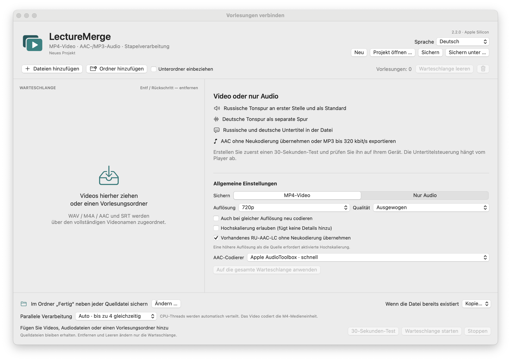

# LectureMerge – Benutzerhandbuch

[Benutzerhandbuch](https://popovantondev.github.io/LectureMerge/Guide-de.html)

[Für macOS laden](https://github.com/popovantondev/LectureMerge/releases/tag/v2.2.0) · [English](../en/README.md) · [Deutsch](README.md) · [Русский](../ru/README.md)

LectureMerge fügt Vorlesungsvideo, russische Vertonung, Originalton und Untertitel in einer MP4-Datei zusammen. Außerdem kann eine Audiospur separat als AAC oder MP3 exportiert werden. Die Verarbeitung erfolgt lokal auf dem Mac; ein Online-Dienst wird nicht verwendet. **Version 2.2.0 · macOS 14 oder neuer · Apple Silicon.**

## Oberflächensprache wählen

Wählen Sie oben rechts **Deutsch**, **English** oder **Русский**. Die Auswahl wird für den nächsten Start gespeichert. Beim ersten Start übernimmt LectureMerge die macOS-Sprache, sofern sie unterstützt wird; andernfalls startet die App auf Russisch.

## Eine MP4-Datei erstellen

1. Fügen Sie einen Vorlesungsordner oder einzelne Video- und Audiodateien hinzu.
2. Wählen Sie einen Eintrag in der Warteschlange und prüfen Sie die zugeordneten Vertonungs- und Untertiteldateien.
3. Wählen Sie **MP4-Video** und legen Sie Auflösung, Qualität, Audio und Ausgabe fest.
4. Wählen Sie einen Ausgabeordner oder behalten Sie den Standardordner neben jedem Quellvideo bei.
5. Erstellen Sie zuerst einen **30-Sekunden-Test** und prüfen Sie das Ergebnis.

Kompatible RU-AAC-LC-Vertonung in M4A/MP4 wird ohne Neukodierung übernommen. WAV und inkompatible Audiodateien werden als AAC-LC codiert. Endet die Vertonung mit dem letzten russischen Untertitel, bleibt das restliche Video erhalten und läuft ohne russische Sprache weiter. Die Sprache wird nicht gestreckt.

Die Videoauflösungen reichen von 144p bis 4K. **Ohne Neukodierung übernehmen** erhält kompatibles H.264 unverändert. **Originalauflösung** behält die Bildgröße bei und kann bei aktivierter Option trotzdem neu codieren. Für Größenänderungen nutzt LectureMerge Apples Hardware-Encoder H.264 VideoToolbox.

## Nur Audio exportieren

Wählen Sie **Nur Audio** und danach die russische Vertonung oder eine Audiospur des Quellvideos. Im AAC-Kopiermodus bleiben vorhandene AAC-Daten unverändert. Weitere AAC-Profile reichen von 96 bis 256 kbit/s; MP3 von 128 bis 320 kbit/s, voreingestellt sind 320 kbit/s. M4A bewahrt Zeitinformationen für die spätere MP4-Zusammenstellung.

## Warteschlange und Projekte

Entfernen Sie einen Eintrag mit Entf oder Rückschritt, der Papierkorb-Schaltfläche oder dem Kontextmenü. **Warteschlange leeren** entfernt nur die Einträge; Quelldateien und fertige Exporte bleiben erhalten. Die Projektbefehle finden Sie im Menü **Projekt** und oben im Fenster. Ein Projekt speichert Pfade und Einstellungen, aber keine Mediendateien.

## Schutz und Einschränkungen

LectureMerge lässt Quelldateien unverändert, schreibt die Ausgabe zunächst temporär und prüft sie, bevor sie im Zielordner abgelegt wird. Übersetzung und Sprachsynthese sind nicht enthalten. Die Untertitelsteuerung hängt vom Media-Player ab. Die App ist ad-hoc signiert und nicht von Apple notarisiert.

## Weitere Dokumentation

- [Anleitung zum Erstellen und Testen](BUILD.md)
- [Architekturübersicht](ARCHITECTURE.md)
- [Rechte und zulässige Nutzung](RIGHTS.md)
- [Hinweise zu Drittanbieter-Komponenten](THIRD_PARTY_NOTICES.md)
- [Prüfbericht zur Version](../VERIFICATION-2.2.0.md)
