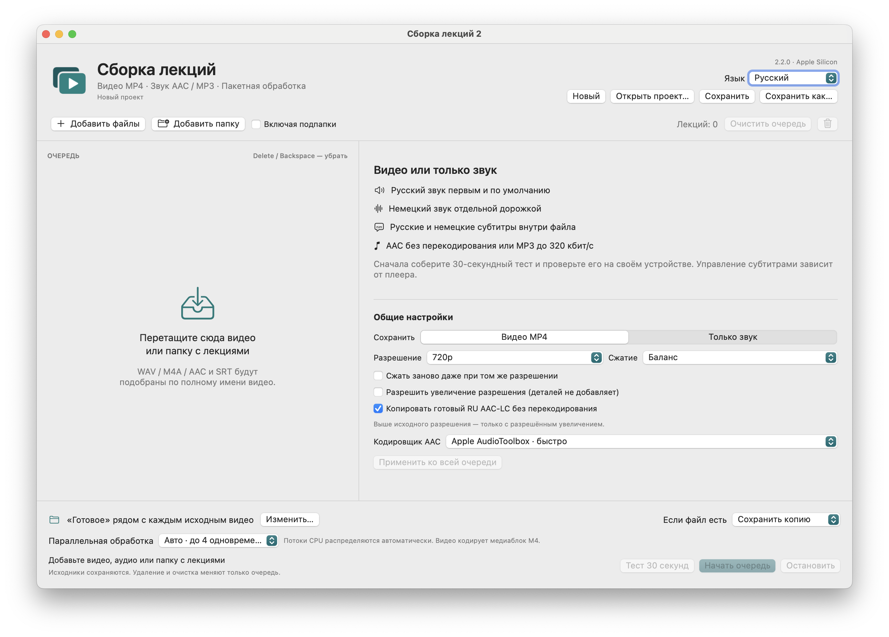

# LectureMerge — руководство пользователя

<!-- public-release:start -->
Объединяет видео лекции, озвучку, исходное аудио и субтитры в MP4; также экспортирует аудио.

**macOS 14+ · Apple Silicon · Выпуск 2.2.0**

**[Скачать](https://github.com/popovantondev/LectureMerge/releases/tag/v2.2.0)** · **[Инструкция](https://popovantondev.github.io/LectureMerge/Guide-ru.html)** · **[Сообщить об ошибке](https://github.com/popovantondev/LectureMerge/issues/new/choose)**

**Требования и ограничения:** Обработка локальная; внешний сервис не нужен. Приложение подписано ad-hoc и не нотарифицировано Apple.

**Первые шаги:** Распакуйте архив приложения, добавьте видео, аудио и субтитры. Проверьте 30-секундный фрагмент перед полным экспортом.

**Файлы приложения:**

- [`LectureMerge-v2.2.0-macos-arm64.zip`](https://github.com/popovantondev/LectureMerge/releases/download/v2.2.0/LectureMerge-v2.2.0-macos-arm64.zip)

**Контрольные суммы:** [`SHA256SUMS`](https://github.com/popovantondev/LectureMerge/releases/download/v2.2.0/SHA256SUMS)
<!-- public-release:end -->

[Скачать для macOS](https://github.com/popovantondev/LectureMerge/releases/tag/v2.2.0) · [English](../en/README.md) · [Deutsch](../de/README.md) · [Русский](README.md)

LectureMerge объединяет видео лекции, русскую озвучку, оригинальный звук и субтитры в MP4. Также можно отдельно экспортировать одну аудиодорожку в AAC или MP3. Обработка выполняется локально на Mac, без онлайн-сервисов. **Версия 2.2.0 · macOS 14 или новее · Apple Silicon.**

## Выбор языка интерфейса

В правом верхнем углу выберите **Русский**, **Deutsch** или **English**. Выбор сохранится для следующего запуска. При первом запуске программа использует язык macOS, если он поддерживается; иначе запускается на русском.

## Сборка MP4

1. Добавьте папку с лекциями или выберите видео и аудиофайлы.
2. Выберите строку очереди и проверьте найденные файлы озвучки и субтитров.
3. Выберите **Видео MP4** и настройте разрешение, качество, звук и папку результата.
4. Укажите папку результата или оставьте папку по умолчанию рядом с каждым исходным видео.
5. Сначала запустите **Тест 30 секунд** и проверьте результат.

Совместимая русская дорожка AAC-LC в M4A/MP4 копируется без перекодирования. WAV и несовместимые аудиофайлы кодируются в AAC-LC. Если озвучка заканчивается вместе с последним русским субтитром, оставшаяся часть видео сохраняется и воспроизводится без русской речи. Темп речи не растягивается.

Разрешения видео — от 144p до 4K. **Без перекодирования** сохраняет совместимый H.264 без изменений. **Исходное разрешение** сохраняет размер кадра, но при включённом параметре видео можно перекодировать. Для изменения разрешения используется аппаратный кодировщик Apple H.264 VideoToolbox.

## Экспорт только звука

Выберите **Только звук**, затем укажите русскую озвучку или аудиодорожку исходного видео. Режим копирования сохраняет уже готовый AAC без изменений. Другие профили AAC доступны от 96 до 256 кбит/с; MP3 — от 128 до 320 кбит/с, по умолчанию выбрано 320. M4A сохраняет временную привязку для последующей сборки MP4.

## Очередь и проекты

Удалите строку клавишами Delete или Backspace, кнопкой корзины либо через контекстное меню. **Очистить очередь** удаляет только записи из списка; исходники и готовые файлы остаются на диске. Команды проекта находятся в меню **Проект** и в верхних кнопках. Файл проекта хранит пути и настройки, но не копирует медиа.

## Сохранность и ограничения

LectureMerge не изменяет исходники, сначала записывает результат во временный файл и проверяет его перед сохранением в целевую папку. Перевод и синтез речи не выполняются. Управление субтитрами зависит от медиаплеера. Приложение имеет ad-hoc подпись и не нотарифицировано Apple.

## Дополнительная документация

- [Сборка и тестирование](BUILD.md)
- [Обзор архитектуры](ARCHITECTURE.md)
- [Права и разрешённое использование](RIGHTS.md)
- [Сведения о сторонних компонентах](THIRD_PARTY_NOTICES.md)
- [Отчёт о проверке версии](../VERIFICATION-2.2.0.md)
